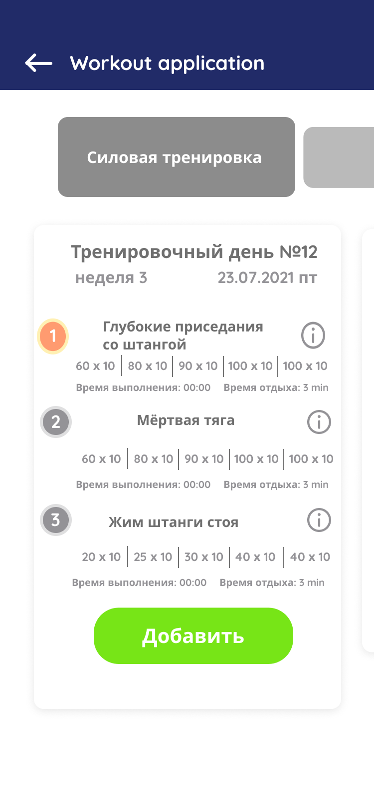

# Workout

## Приложение для составления тренировок в спортзале, отслеживания тренировочного прогресса.

### ok-202105-workout-kkh

Workout, Константин Хан

Ключевая идея: Приложение позволяет составить тренировочный протокол и помогает придерживаться системных занятий за счет 
учета прогресса и системы оповещений.

### Базовая функциональность:
* фиксация антропометрических данных и хранение истории их изменений;
* база данных упражнений с возможностью добавления своих упражнений, в т.ч. на основе имеющихся;
* база данных тренировочных программ с описанием техники выполнения;
* наличие возможности добавления своей тренировочной программы, в т.ч. на основе
  имеющихся;
* тренировочные программы должны иметь возможность дополнительной настройки;
* наличие "Избранного" для быстрого доступа к упражнениям;
* тренировочный календарь с системой оповещений;
* наличие статистики выполнения тренировочных программ (учет веса отягощения, количества подходов и повторений на конкретную дату);
* таймер;
* анализатор программ тренировок (проверка на простейшие принципы построения тренировочных программ).

### Потенциальное развитие функциональности:
* возможность авторизации через соц. сети;
* социальная составляющая;
* наличие фотодневника;
* наличие дневника питания;
* Расчет индекса массы тела;
* интеграция с мессенджерами для обмена сообщениями и контентом;
* интеграция с соц. сетями для обмена сообщениями и контентом;
* интеграция с фитнес-приложениями (Google Fit, Health Fit, Mi Fit...);
* интеграция встроенного тренировочного календаря с Google Calendar;
* возможность загрузки на устройство только отдельных тренировочных программ;
* возможность загрузки на устройство только отдельных упражнений;
* возможность использования приложения без регистрации (должна быть ограниченная функциональность);
* автоматическая синхронизация данных с сервером;

Пользователи:
* Тренеры
* Люди, которые занимаются фитнесом "для себя"
* Люди, которые занимаются фитнесом "на результат"

Ключевые потребности пользователей (to do)

Монетизация (to do)

Анализ конкурентов. Данные с сайтов:

* https://rskrf.ru/tips/obzory-i-topy/7-luchshikh-fitnes-prilozheniy-dlya-android/

* https://rskrf.ru/tips/obzory-i-topy/7-luchshikh-fitnes-prilozheniy-na-ios/

На что обращают внимание пользователи:

Что нравится?                                                        | Что не нравится?
-------------------------------------------------------------------- | -------------
Большое количество программ тренировок                               | Необходимость авторизации при первом запуске
Поддержка Google Fit                                                 | Недостаточная простота использования
Детальное аудиосопровождение                                         | Отсутствие русификации
Возможность загрузки только отдельных тренировок                     | Средний уровень безопасности
Возможность создать свою тренировку                                  | Невозможность добавления упражнения или тренировок в избранное
Возможность добавлять упражнения в избранное                         | Отсутствие социальной составляющей
Наличие справочника упражнений                                       | Отсутствие аудиосопровождения
Возможность создать свое упражнение                                  | Невозможность создать свою тренировку
Продвинутая статистика                                               | Отсутствие справочника упражнений
Наличие экспорта данных                                              | Большой вес приложения
Отсутствие встроенных покупок                                        | Плохое качество русификации
Наличие раздела с полезными статьями                                 | Недостаточная адаптация для людей с ограниченными возможностями
Отсутствие рекламных материалов                                      | Демонстрация упражнений в виде отдельных изображений
Привлекательный дизайн                                               | Отсутствие автоматической синхронизации
Наличие программы тренировок с возможностью настройки                | Небольшое количество программ тренировок
Поддержка ориентаций                                                 | Долгое время запуска приложения
Возможность загрузки видео только отдельных упражнений               | Рекламные материалы, отвлекающие от основного контента
Наличие дневника питания                                             | Обязательная авторизация
Малый вес приложения                                                 | Невозможность планирования тренировки
Наличие фотодневника                                                 | Невозможность удаления скачанных видеоматериалов
Использование без регистрации                                        | Отсутствие мотивационной составляющей
Высокий уровень безопасности                                         | Отсутствие синхронизации данных
Простота использования                                               |
Расчет ИМТ                                                           |
Степень (ср., высок.) научности объяснения упражнений                |
Поддержка Health Kit («Здоровье»)                                    |
Виджет                                                               |
Грамотность описания упражнений                                      |
Поддержка 3D Touch                                                   |
Возможность удаления скачанного контента                             |
Видео для каждого упражнения с советами по выполнению                |
Деление упражнений по типам (базовый, продвинутый, профессиональный) |
Возможность исключить «шумные» упражнения                            |
Подробные описания упражнений и советы по их выполнению              |